# Giggles Application Complete Workflow

```mermaid
flowchart TB
    Start([User Opens Application]) --> Auth{User Authenticated?}
    
    Auth -->|No| Login[Login/Register Screen]
    Login --> SupabaseAuth[Supabase Auth<br/>Email/Password + MFA]
    SupabaseAuth --> Dashboard
    Auth -->|Yes| Dashboard[Dashboard View]
    
    Dashboard --> HasKey{Limitless<br/>API Key<br/>Exists?}
    
    HasKey -->|No| EnterKey[Enter Limitless API Key]
    EnterKey --> EncryptKey[Encrypt with AES-256-GCM]
    EncryptKey --> StoreKey[Store in Supabase<br/>limitless_keys table]
    StoreKey --> Dashboard
    
    HasKey -->|Yes| DailySummary[Display Daily Summary Cards]
    
    DailySummary --> UserClick{User Action}
    
    UserClick -->|Click Day| DayView[Day Detail View]
    UserClick -->|Click Update| TriggerManual[Manual Processing Trigger]
    UserClick -->|Delete All| DeleteData[Delete All Data]
    
    DayView --> FetchDetections[Fetch Laughter Detections<br/>for Selected Date]
    FetchDetections --> DisplayDetections[Display Detections with:<br/>- Timestamp<br/>- Audio Player<br/>- Probability<br/>- Laughter Class<br/>- Notes]
    
    DisplayDetections --> PlayAudio[User Plays Audio Clip]
    PlayAudio --> DecryptPath[Decrypt File Path]
    DecryptPath --> ServeAudio[Serve Audio File]
    
    TriggerManual --> CheckDate{Is Current<br/>Day?}
    CheckDate -->|Yes| ProcessCurrent[Process Current Day<br/>2-hour chunks up to now]
    CheckDate -->|Previous Day| ProcessFull[Process Full Day<br/>24 hours in 2-hour chunks]
    
    ProcessCurrent --> LimitlessAPI[Call Limitless API<br/>GET /v1/download-audio]
    ProcessFull --> LimitlessAPI
    
    LimitlessAPI --> ValidateSegments{Segments<br/>Valid?}
    ValidateSegments -->|No| Skip[Skip Invalid Segment]
    ValidateSegments -->|Yes| StoreSegment[Store Audio Segment<br/>in Supabase<br/>audio_segments table]
    
    StoreSegment --> CheckDuplicate{Already<br/>Processed?}
    CheckDuplicate -->|Yes| SkipProcessing[Skip - Already Processed]
    CheckDuplicate -->|No| DownloadAudio[Download Audio File<br/>OGG format]
    
    DownloadAudio --> StoreFile[Store in /audio directory]
    
    StoreFile --> YAMNet[Process with YAMNet<br/>TensorFlow Model]
    
    YAMNet --> DetectLaughter{Detect<br/>Laughter?<br/>Probability > 0.1}
    
    DetectLaughter -->|No| DeleteAudio[Delete Downloaded Audio<br/>Secure Deletion]
    DetectLaughter -->|Yes| ExtractClip[Extract 4-second Clip<br/>2s before + 2s after]
    
    ExtractClip --> StoreClip[Store Clip in /clips directory]
    StoreClip --> EncryptClipPath[Encrypt Clip Path]
    
    EncryptClipPath --> StoreDetection[Store Laughter Detection<br/>in Supabase:<br/>- timestamp<br/>- probability<br/>- class_id<br/>- class_name<br/>- clip_path encrypted]
    
    StoreDetection --> CheckDupeDup{Check Duplicate<br/>5-second window}
    CheckDupeDup -->|Duplicate| DeleteClip[Delete Duplicate Clip]
    CheckDupeDup -->|Unique| KeepDetection[Keep Detection]
    
    DeleteClip --> DeleteAudio
    KeepDetection --> DeleteAudio
    
    DeleteAudio --> NextSegment{More<br/>Segments?}
    NextSegment -->|Yes| LimitlessAPI
    NextSegment -->|No| ProcessingLog[Create Processing Log<br/>in processing_logs table]
    
    ProcessingLog --> UpdateSegmentStatus[Mark Audio Segment<br/>as Processed]
    UpdateSegmentStatus --> DailySummary
    
    DeleteData --> DecryptAllClips[Decrypt All Clip Paths]
    DecryptAllClips --> DeleteAllFiles[Delete All Audio Files<br/>from Disk]
    DeleteAllFiles --> DeleteFromDB[Delete All Records from:<br/>- laughter_detections<br/>- audio_segments<br/>- processing_logs]
    DeleteFromDB --> LogoutRedirect[Redirect to Login]
    
    %% Scheduler (Nightly Background Processing)
    Scheduler[Background Scheduler<br/>Runs at 2:00 AM Daily] --> GetActiveUsers[Get All Users<br/>with Limitless Keys]
    GetActiveUsers --> GetPreviousDay[Calculate Previous Day Range]
    GetPreviousDay --> ProcessPreviousDay[Process Previous Day<br/>24 hours in 2-hour chunks]
    ProcessPreviousDay --> LimitlessAPI
    
    %% Cleanup Task
    CleanupTask[Cleanup Task<br/>Runs Hourly] --> FindOrphanedFiles[Find Orphaned Audio Files<br/>not in database]
    FindOrphanedFiles --> DeleteOrphaned[Secure Delete Orphaned Files]
    
    %% Styling
    classDef userAction fill:#e1f5ff,stroke:#0288d1,stroke-width:2px
    classDef supabase fill:#3ecf8e,stroke:#1fb864,stroke-width:2px
    classDef processing fill:#fff9c4,stroke:#f57f17,stroke-width:2px
    classDef security fill:#ffebee,stroke:#c62828,stroke-width:2px
    classDef storage fill:#f3e5f5,stroke:#6a1b9a,stroke-width:2px
    
    class Login,EnterKey,Dashboard,DailySummary,DayView,UserClick userAction
    class SupabaseAuth,StoreKey,StoreSegment,StoreDetection,ProcessingLog,UpdateSegmentStatus supabase
    class YAMNet,DetectLaughter,ExtractClip,LimitlessAPI,ValidateSegments processing
    class EncryptKey,EncryptClipPath,DecryptPath,Secure,DecryptAllClips,DeleteAllFiles security
    class DownloadAudio,StoreFile,StoreClip,DeleteAudio storage
```

## Key Components Explained:

### 1. Authentication Flow
- User registers/logs in via Supabase Auth
- Email/password + MFA authentication
- JWT tokens for session management

### 2. API Key Management
- Limitless API key entered by user
- Encrypted with AES-256-GCM before storage
- Stored in Supabase `limitless_keys` table with RLS

### 3. Audio Processing Pipeline
- **Daily Processing (2 AM)**: Automated scheduler processes previous day's audio
- **Manual Trigger**: User can trigger processing for current day
- **2-Hour Chunks**: Limitless API limit requires chunking 24-hour periods
- **YAMNet Analysis**: TensorFlow model detects laughter with probabilities
- **Clip Extraction**: 4-second clips (2s before + 2s after detection)
- **Encryption**: All file paths encrypted before database storage

### 4. Duplicate Prevention
- Timestamp-based: Exact matches filtered
- Time window: 5-second deduplication window
- Clip path: Prevents same file being processed twice

### 5. Data Display
- **Daily Summary**: Cards showing laughter counts per day
- **Day Detail View**: Individual detections with timestamps, audio playback, probabilities, and laughter classes
- **Audio Playback**: Secure file serving with authentication

### 6. Cleanup & Security
- Original audio files deleted after processing
- Orphaned file cleanup runs hourly
- Secure file deletion prevents data recovery
- Row Level Security (RLS) ensures user data isolation

### 7. Background Tasks
- **Scheduler**: Nightly audio processing at 2:00 AM
- **Cleanup Task**: Hourly orphaned file cleanup
- **Processing Logs**: Track all processing attempts and results