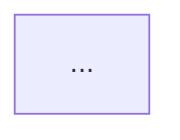

# How to View the User Flow Diagram

The complete user flow diagram is in `docs/USER_FLOW_DIAGRAM.md` as a Mermaid diagram.

## Quick Ways to View:

### Option 1: GitHub (Easiest)
1. Push your branch to GitHub
2. Navigate to `docs/USER_FLOW_DIAGRAM.md` in the GitHub web interface
3. GitHub automatically renders Mermaid diagrams!

### Option 2: Mermaid Live Editor (Best for Editing)
1. Go to https://mermaid.live
2. Copy the Mermaid code from `docs/USER_FLOW_DIAGRAM.md` (the code between ```mermaid and ```)
3. Paste it into the editor
4. See it rendered instantly!

### Option 3: VS Code Extension
1. Install the "Markdown Preview Mermaid Support" extension
2. Open `docs/USER_FLOW_DIAGRAM.md`
3. Press `Cmd+Shift+V` (Mac) or `Ctrl+Shift+V` (Windows) to preview
4. The diagram will render in the preview!

### Option 4: Online Mermaid Viewer
- https://mermaid.live
- https://mermaid-js.github.io/mermaid-live-editor/

## Quick Copy-Paste for Mermaid Live:

The diagram code starts at line 21 in `docs/USER_FLOW_DIAGRAM.md` and ends before the closing ```.

You can copy the entire section between:
```

```

## What the Diagram Shows:

- **Authentication Flow** (Registration & Login)
- **API Key Setup** (Encryption & Storage)
- **Dashboard & Daily Summary**
- **Manual Processing Flow**
- **Nightly Cron Processing**
- **Audio Processing Pipeline** (Limitless API → YAMNet → Storage)
- **Day Detail View** (Audio Playback, Notes, Deletion)
- **Settings & Data Management**
- **Error Handling**

The diagram uses color coding:
- 🔵 Blue: Authentication flow
- 🟠 Orange: Processing flow
- 🟢 Green: Data operations
- 🔴 Red: Error handling

