# Complete User Flow Diagram

This document provides a comprehensive visual representation of the entire user flow through the Laughter Detector application, from initial registration through daily use.

---

## Complete Application Flow

```mermaid
flowchart TB
    Start([User Opens Application]) --> CheckAuth{User Authenticated?}
    
    %% Authentication Flow
    CheckAuth -->|No| ShowAuth[Show Login/Register Screen]
    ShowAuth --> UserChoice{User Action}
    UserChoice -->|Register| Register[User Enters:<br/>- Email<br/>- Password<br/>- Timezone Auto-detected]
    UserChoice -->|Login| Login[User Enters:<br/>- Email<br/>- Password]
    
    Register --> ValidateReg{Validate<br/>Email & Password}
    ValidateReg -->|Invalid| ShowError[Show Error Message]
    ShowError --> ShowAuth
    ValidateReg -->|Valid| CreateSupabase[Create User in Supabase Auth]
    
    CreateSupabase --> EnableMFA[Enable MFA by Default]
    EnableMFA --> CreateProfile[Create User Profile<br/>with Timezone]
    CreateProfile --> StoreSession[Store Session Token]
    StoreSession --> Dashboard
    
    Login --> ValidateLogin{Validate<br/>Credentials}
    ValidateLogin -->|Invalid| ShowError
    ValidateLogin -->|Valid| GetSession[Get Supabase Session]
    GetSession --> Dashboard
    
    %% Main Dashboard
    Dashboard[Main Dashboard] --> CheckKey{Limitless<br/>API Key<br/>Exists?}
    
    CheckKey -->|No| ShowKeySetup[Show API Key Setup Screen]
    ShowKeySetup --> UserEntersKey[User Enters<br/>Limitless API Key]
    UserEntersKey --> EncryptKey[Encrypt Key with<br/>AES-256-GCM]
    EncryptKey --> StoreKey[Store Encrypted Key<br/>in Supabase]
    StoreKey --> Dashboard
    
    CheckKey -->|Yes| FetchDailySummary[Fetch Daily Summary<br/>from Database]
    FetchDailySummary --> ConvertTimezone[Convert Timestamps<br/>to User Timezone]
    ConvertTimezone --> GroupByDate[Group Detections<br/>by Local Date]
    GroupByDate --> ShowSummaryCards[Display Daily Summary Cards:<br/>- Day of Week<br/>- Laugh Count<br/>- Date]
    
    %% User Actions from Dashboard
    ShowSummaryCards --> UserAction{User Action}
    
    UserAction -->|Click Day Card| DayDetail[Show Day Detail View]
    UserAction -->|Click Update| ManualProcess[Trigger Manual Processing]
    UserAction -->|Click Settings| Settings[Show Settings Screen]
    UserAction -->|Click Delete All| DeleteAll[Confirm Delete All Data]
    
    %% Day Detail View
    DayDetail --> FetchDayDetections[Fetch Detections<br/>for Selected Date]
    FetchDayDetections --> FilterByDate[Filter by Date<br/>in User Timezone]
    FilterByDate --> DisplayDetections[Display Detections:<br/>- Timestamp<br/>- Probability<br/>- Laughter Class<br/>- Audio Player]
    
    DisplayDetections --> PlayAudio{User Clicks<br/>Play Audio}
    PlayAudio --> DecryptPath[Decrypt File Path]
    DecryptPath --> ServeFile[Serve Audio File<br/>via nginx]
    ServeFile --> PlayAudio
    
    DisplayDetections --> EditNote{User Edits<br/>Note}
    EditNote --> UpdateNote[Update Detection<br/>in Database]
    UpdateNote --> DisplayDetections
    
    DisplayDetections --> DeleteDetection{User Deletes<br/>Detection}
    DeleteDetection --> DeleteFile[Delete Audio File]
    DeleteFile --> DeleteDB[Delete from Database]
    DeleteDB --> FetchDayDetections
    
    DisplayDetections --> BackToSummary[User Clicks Back]
    BackToSummary --> ShowSummaryCards
    
    %% Manual Processing Flow
    ManualProcess --> CheckDate{Is Current<br/>Day?}
    CheckDate -->|Yes| CalcCurrentRange[Calculate Range:<br/>Start of Day to Now<br/>in User Timezone]
    CheckDate -->|Previous Day| CalcFullRange[Calculate Range:<br/>Full 24 Hours<br/>in User Timezone]
    
    CalcCurrentRange --> ConvertToUTC[Convert to UTC<br/>for API Calls]
    CalcFullRange --> ConvertToUTC
    
    ConvertToUTC --> CallLimitless[Call Limitless API<br/>GET /v1/download-audio]
    CallLimitless --> GetSegments[Get Audio Segments<br/>Response]
    
    GetSegments --> ValidateSegment{Segment<br/>Valid?}
    ValidateSegment -->|No| SkipSegment[Skip Invalid Segment]
    ValidateSegment -->|Yes| CheckProcessed{Already<br/>Processed?}
    
    CheckProcessed -->|Yes| SkipSegment
    CheckProcessed -->|No| StoreSegment[Store Segment Metadata<br/>in audio_segments table]
    
    StoreSegment --> DownloadOGG[Download OGG Audio File]
    DownloadOGG --> StoreOGG[Store in<br/>uploads/audio/user_id/]
    
    StoreOGG --> LoadYAMNet[Load YAMNet<br/>TensorFlow Model]
    LoadYAMNet --> ProcessAudio[Process Audio:<br/>- Convert to WAV<br/>- Run Inference<br/>- Detect Events]
    
    ProcessAudio --> CheckLaughter{Laughter<br/>Detected?<br/>Probability > 0.1}
    
    CheckLaughter -->|No| DeleteOGG[Delete OGG File<br/>Secure Deletion]
    CheckLaughter -->|Yes| ExtractClip[Extract 4-second Clip:<br/>2s before + 2s after<br/>Laughter Timestamp]
    
    ExtractClip --> SaveClip[Save WAV Clip in<br/>uploads/clips/user_id/]
    SaveClip --> CheckDuplicate{Check Duplicate:<br/>5-second window<br/>Same class_id}
    
    CheckDuplicate -->|Duplicate| DeleteClip[Delete Duplicate Clip]
    CheckDuplicate -->|Unique| EncryptPath[Encrypt Clip Path<br/>AES-256-GCM]
    
    EncryptPath --> StoreDetection[Store Detection in<br/>laughter_detections table:<br/>- timestamp<br/>- probability<br/>- class_id<br/>- class_name<br/>- encrypted clip_path]
    
    DeleteClip --> DeleteOGG
    StoreDetection --> DeleteOGG
    
    DeleteOGG --> MoreSegments{More<br/>Segments?}
    MoreSegments -->|Yes| ValidateSegment
    MoreSegments -->|No| CreateLog[Create Processing Log<br/>in processing_logs table]
    
    CreateLog --> MarkProcessed[Mark Segments<br/>as Processed]
    MarkProcessed --> ShowSummaryCards
    
    SkipSegment --> MoreSegments
    
    %% Nightly Cron Processing
    CronJob[Nightly Cron Job<br/>Runs at 2:00 AM Daily] --> GetAllUsers[Get All Active Users<br/>with Limitless Keys]
    GetAllUsers --> ForEachUser{For Each User}
    
    ForEachUser --> GetUserTZ[Get User Timezone]
    GetUserTZ --> CalcYesterday[Calculate 'Yesterday'<br/>in User's Timezone]
    CalcYesterday --> ConvertToUTC2[Convert to UTC<br/>for Processing]
    ConvertToUTC2 --> DecryptKey[Decrypt User's<br/>Limitless API Key]
    
    DecryptKey --> CallLimitless2[Call Limitless API<br/>Same Flow as Manual]
    CallLimitless2 --> ProcessAudio2[Process Audio<br/>Same Flow as Manual]
    ProcessAudio2 --> SaveLog[Save Processing Log]
    
    SaveLog --> NextUser{More<br/>Users?}
    NextUser -->|Yes| ForEachUser
    NextUser -->|No| Complete[Processing Complete]
    
    %% Settings Screen
    Settings --> ShowSettings[Display Settings:<br/>- Reprocess Date Range<br/>- Delete Limitless Key<br/>- Delete All Data]
    
    ShowSettings --> ReprocessRange{User Clicks<br/>Reprocess?}
    ReprocessRange -->|Yes| EnterDates[User Enters<br/>Start & End Dates]
    EnterDates --> ValidateDates{Valid<br/>Date Range?}
    ValidateDates -->|No| ShowError2[Show Error]
    ValidateDates -->|Yes| ManualProcess
    
    ShowSettings --> DeleteKey{User Clicks<br/>Delete Key?}
    DeleteKey -->|Yes| ConfirmDeleteKey[Confirm Deletion]
    ConfirmDeleteKey --> DeleteKeyDB[Delete Key from<br/>Database]
    DeleteKeyDB --> ShowKeySetup
    
    %% Delete All Data Flow
    DeleteAll --> ConfirmDelete[Confirm Deletion]
    ConfirmDelete -->|Cancel| ShowSummaryCards
    ConfirmDelete -->|Confirm| DecryptAllClips[Decrypt All Clip Paths]
    DecryptAllClips --> DeleteAllFiles[Delete All Audio Files<br/>from Disk]
    DeleteAllFiles --> DeleteAllDB[Delete All Records from:<br/>- laughter_detections<br/>- audio_segments<br/>- processing_logs<br/>- limitless_keys]
    DeleteAllDB --> ClearSession[Clear Session Token]
    ClearSession --> ShowAuth
    
    %% Error Handling
    ShowError --> ShowAuth
    ShowError2 --> ShowSettings
    
    %% Styling
    classDef authFlow fill:#e1f5ff
    classDef processFlow fill:#fff4e1
    classDef dataFlow fill:#e8f5e9
    classDef errorFlow fill:#ffebee
    
    class Register,Login,CreateSupabase,EnableMFA,CreateProfile authFlow
    class ManualProcess,CronJob,CallLimitless,ProcessAudio,LoadYAMNet processFlow
    class StoreDetection,StoreKey,EncryptKey,DecryptKey dataFlow
    class ShowError,ShowError2,DeleteAll errorFlow
```

---

## Key Components Explained

### 1. Authentication Flow (Blue)
- **Registration**: User creates account with email, password, and auto-detected timezone
- **Login**: User authenticates with existing credentials
- **Security**: MFA enabled by default, user profile created with RLS enforcement

### 2. Processing Flow (Orange)
- **Manual Processing**: User triggers processing for current or previous day
- **Nightly Cron**: Automated processing runs at 2:00 AM for all users
- **Audio Pipeline**: Limitless API → Download → YAMNet → Extract Clips → Store

### 3. Data Flow (Green)
- **Encryption**: API keys and file paths encrypted with AES-256-GCM
- **Storage**: Supabase database with RLS policies for user isolation
- **File System**: User-specific directories (`uploads/audio/user_id/`, `uploads/clips/user_id/`)

### 4. User Interface
- **Dashboard**: Daily summary cards showing laugh counts per day
- **Day Detail**: List of detections with audio playback and notes
- **Settings**: Reprocess data, manage API key, delete all data

---

## Security Features

1. **Authentication**: Supabase Auth with JWT tokens
2. **Encryption**: AES-256-GCM for API keys and file paths
3. **RLS Policies**: Database-level user isolation
4. **File Isolation**: User-specific directories prevent cross-user access
5. **Secure Deletion**: Files deleted immediately after processing

---

## Timezone Handling

- **Registration**: Browser timezone auto-detected and stored
- **Display**: All timestamps converted to user's timezone
- **Processing**: Date ranges calculated in user's timezone, converted to UTC for API calls
- **Nightly Cron**: Processes "yesterday" based on each user's timezone

---

## Data Lifecycle

1. **Download**: Audio segments downloaded from Limitless API
2. **Process**: YAMNet detects laughter events
3. **Extract**: 4-second clips extracted around detections
4. **Store**: Detections stored in database, clips stored on disk
5. **Cleanup**: Original OGG files deleted after processing
6. **Deletion**: User can delete individual detections or all data

---

## See Also

- [README.md](../README.md) - Project overview
- [Security Documentation](./security/SECURITY_AUDIT_FULL.md) - Security details
- [Deployment Guide](./deployment/VPS_DEPLOYMENT_PLAN.md) - Deployment information

